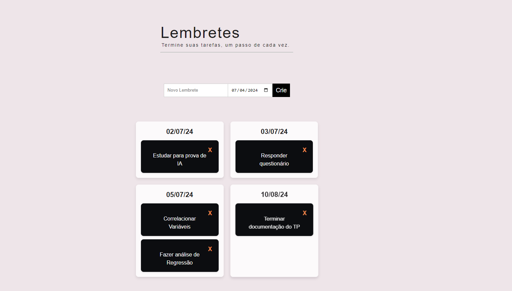

# todo-list

Este é um aplicativo de lista de tarefas desenvolvido com React.


## Tecnologias Utilizadas

- React
- Redux Toolkit
- TypeScript
- Node.js (para o backend da API)
- Express (para o backend da API)

## Componentes

### TaskForm

Um formulário para criar novas tarefas na lista.

### TaskCarousel

Um componente que exibe as tarefas agrupadas por data em um carousel.

### TaskCard

Componente individual que exibe os detalhes de uma tarefa e permite excluí-la.

## Executando o Projeto

### Pré-requisitos

- Node.js instalado
- Yarn ou npm instalado

### Backend (API)

1. Navegue até o diretório `api/`:

   ```bash
   cd api
2. Instale as dependências:

    ```bash
    npm install


3. Compile o código typescript:
    ```bash
    npm run build

5. Inicie o servidor da API:

    ```bash
    npm start
Assim, o servidor estará executando em `http://localhost:3000`

### Frontend (React App)

1. Navegue até o diretório `frontend/`:
    ```bash
    cd frontend/


2. Instale as dependências:
    ```bash
    npm install


3. Inicie o aplicativo React:
    ```bash
    npm dev

O aplicativo estará disponível em `http://localhost:` na porta apontada no terminal.

## Premissas assumidas
No que tange o requisito 

> O campo “Data” deverá estar preenchido, com uma data válida, e essa data tem de estar no futuro

Foi considerado que o dia atual também é uma data válida.

> Caso os valores dos campos sejam válidos, o novo lembrete deverá ser exibido na seção “Lista de lembretes”

Foi optado por não ter um título “Lista de lembretes” explicitamente.

## Decisões de projeto

Grande parte das decisões foram tomadas para fazer que a tech stack seja consistente e eficiente. Por exemplo, foi decidido usar Redux para manipular o estado da aplicação, visto que essa solução é conhecida na comunidade. O mesmo se dá pela escolha do framework de testes.

Para o desenvolvimento da API, como a aplicação é simples e direta, foi optado por não usar um sistema de gerênciamento de banco de dados, nem mesmo uma linguagem de query. Os dados são armazenados como uma lista de jsons que cresce e diminui perante a interação do usuário. A lista é armazenada em um arquivo para que os dados persistam.

De maneira similar, a estrutura dos diretórios também foi pensada de forma a equilibrar a praticidade e as boas práticas da comunidade: 
- **src/**: Contém o código-fonte da aplicação.
  - **Components/**: Componentes reutilizáveis da interface do usuário.
  - **Pages/**: Componentes de páginas principais da aplicação.
  - **store/**: Configuração do Redux e store da aplicação.
  - **reducers/**: Redutores Redux para gerenciar o estado das tarefas.
  - **utils/**: Funções utilitárias, como formatação de datas ou funções auxiliares.
- **package.json**: Arquivo de configuração do npm/yarn com dependências e scripts.
- **tsconfig.json**: Configuração do TypeScript para o projeto.
- **vite.config.ts**: Configuração do Vite, se aplicável.

<hr>

- **data/**: Armazenamento de dados da aplicação.
- **src/**: Contém o código-fonte da aplicação.
  - **controllers/**: Controladores que lidam com a lógica de negócio da API.
  - **models/**: Definições dos modelos de dados da aplicação.
  - **routes/**: Definição das rotas da API.
- **app.js**: Configuração e inicialização da aplicação Express.

Por fim, como os dados fluem de maneira previsível e encapsulada pelos componentes, POO não foi necessário.

